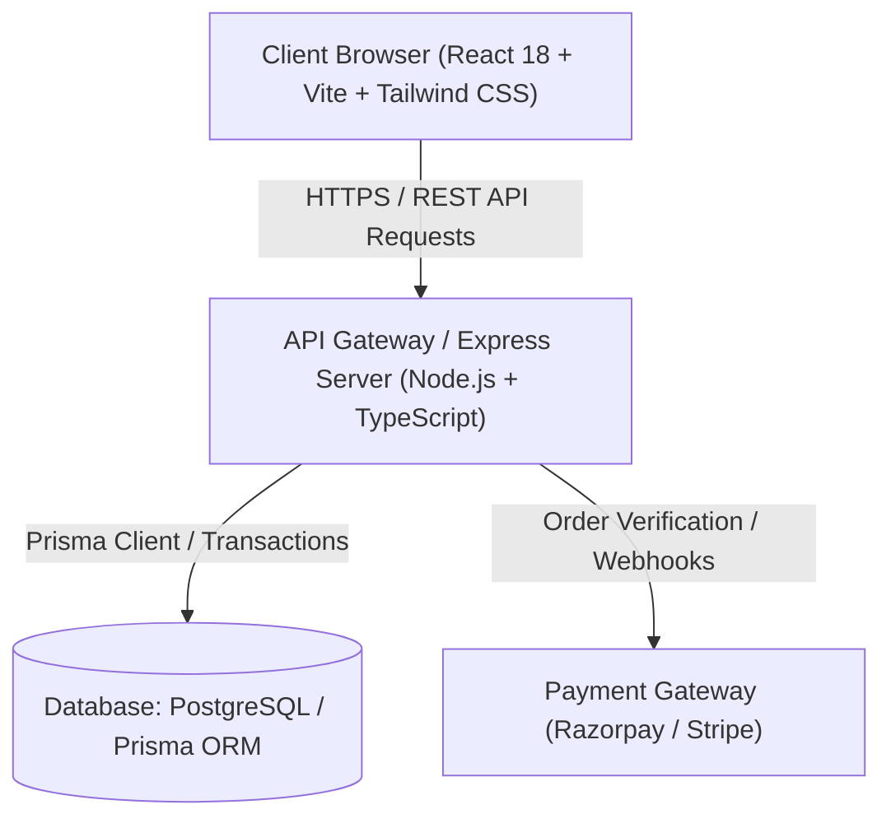

# Architecture Documentation — ApexCart

ApexCart is built using a clean, decoupled client-server architecture designed for high availability, security, and extensibility.

---

## 1. High-Level Architecture

ApexCart follows a classic layered pattern where presentation, business logic, persistence, and external payment integration are strictly separated:

---

## 2. Frontend Layer (React + TypeScript)

The frontend is constructed using modern declarative React patterns:

- **State Management**:
  - **Zustand**: Fast, lightweight stores for client session state (`authStore`, `cartStore`, `wishlistStore`).
  - **TanStack Query (React Query)**: Server state synchronization, automated caching, deduplication, and refetching.
- **Component Design System**:
  - Reusable primitive components (`Button`, `Input`, `RatingStars`, `ProductCard`, `SearchModal`, `CartDrawer`).
  - Strict semantic HTML markup with accessible ARIA attributes.
- **Styling**:
  - Tailwind CSS with responsive breakpoints (`sm`, `md`, `lg`, `xl`).
  - Clean font pairing using Google Font *Plus Jakarta Sans*.

---

## 3. Backend Layer (Express + TypeScript)

The backend employs the **Controller-Service-Repository** pattern:

1. **Routing Layer (`server/src/routes/`)**:
   - Maps URL endpoints to controllers.
   - Enforces rate limiting (`express-rate-limit`).
   - Validates input payloads using Zod schemas before reaching business logic.
2. **Middleware Layer (`server/src/middleware/`)**:
   - `auth.middleware.ts`: Verifies JSON Web Tokens (JWT) and enforces Role-Based Access Control (RBAC).
   - `validate.middleware.ts`: Sanitizes and validates `req.body`, `req.query`, and `req.params`.
   - `error.middleware.ts`: Centralizes application error responses, strips raw stack traces in production, and maps database error codes (e.g., Prisma unique constraint violations).
3. **Controller Layer (`server/src/controllers/`)**:
   - Handles incoming HTTP requests, unpacks parameters, and invokes services.
   - Formats responses with standard structure using `ApiResponse`.
4. **Service Layer (`server/src/services/`)**:
   - Implements core business logic (atomic stock validation, discount calculation, verified review checks).
   - Manages Prisma database transactions.

---

## 4. Key Design Decisions

### A. Atomic Inventory Deductions
Orders are processed inside a database transaction (`prisma.$transaction`). Stock is checked and decremented atomically. If any item is out of stock, the transaction rolls back, preventing overselling race conditions.

### B. Server-Side Discount Calculation
Coupons are **never** calculated on the client side. The frontend passes only the coupon code string. The server checks start/expiry dates, min order requirements, per-user limits, and applies percentage caps server-side.

### C. Verified Reviews Only
To maintain authentic ratings, only users who have ordered and received the product can submit a review.

### D. Multi-Database Flexibility
The project provides full **PostgreSQL** production schemas (with `Decimal` and enums) while maintaining parity with zero-config local **SQLite** for instant evaluation without installing external database services.
