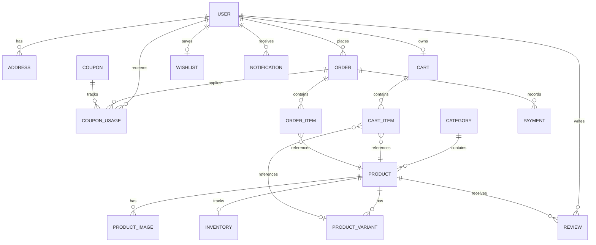

# Database Architecture & Schema Documentation

The ApexCart data layer is built on **Prisma ORM** with full support for **PostgreSQL** in production and **SQLite** for rapid local development.

---

## 1. Entity Relationship Model



---

## 2. Core Models Description

### `User`
- **Fields**: `id`, `email`, `passwordHash`, `firstName`, `lastName`, `phone`, `avatarUrl`, `role` (`CUSTOMER` | `ADMIN`), `isActive`, `createdAt`, `updatedAt`.
- **Indexes**: `email` (unique index), `role`.

### `Address`
- **Fields**: `id`, `userId`, `fullName`, `addressLine1`, `addressLine2`, `city`, `state`, `postalCode`, `country`, `phone`, `isDefault`, `type` (`SHIPPING` | `BILLING`).
- **Cascade**: Deletes automatically if the parent user is deleted.

### `Product`
- **Fields**: `id`, `title`, `slug` (unique), `description`, `brand`, `sku` (unique), `price`, `salePrice`, `isPublished`, `isFeatured`, `categoryId`, `rating`, `reviewCount`, `specifications` (JSON), `createdAt`, `updatedAt`.
- **Indexes**: `slug`, `categoryId`, `brand`, `[isPublished, isFeatured]`.

### `ProductVariant`
- Enables options such as Color, Size, and Storage Capacity.
- **Fields**: `id`, `productId`, `name`, `sku` (unique), `price`, `salePrice`, `stock`, `color`, `size`.

### `Inventory`
- Dedicated stock level monitor.
- **Fields**: `id`, `productId`, `quantity`, `reserved`, `minThreshold`, `updatedAt`.

### `Cart` & `CartItem`
- Supports both authenticated users (`userId`) and guest visitors (`sessionId`).
- Automatically merges guest session cart into user account upon authentication.

### `Order` & `OrderItem`
- **Order Status**: `PENDING`, `CONFIRMED`, `PROCESSING`, `SHIPPED`, `OUT_FOR_DELIVERY`, `DELIVERED`, `CANCELLED`, `RETURN_REQUESTED`, `RETURNED`.
- **Snapshot Storage**: `OrderItem` stores the product name, SKU, and unit price at the time of purchase to ensure financial audits remain consistent even if product pricing changes later.

### `Coupon` & `CouponUsage`
- Server-side promotion engine.
- Tracks `usageLimit` (global cap) and `perUserLimit` (cap per customer).

### `Review`
- Requires verified purchase linking to an `OrderItem` or validated past order.
- Dynamically recalculates average rating and review counts on the parent `Product`.

---

## 3. Database Switching (PostgreSQL vs SQLite)

- **PostgreSQL (Production)**:
  `prisma/schema.postgresql.prisma` uses PostgreSQL types:
  ```prisma
  datasource db {
    provider = "postgresql"
    url      = env("DATABASE_URL")
  }
  ```
- **SQLite (Zero-Config Development)**:
  `prisma/schema.sqlite.prisma` provides instant zero-daemon local run.

To generate and push database tables:
```bash
npm run prisma:generate
npm run prisma:push
npm run prisma:seed
```
